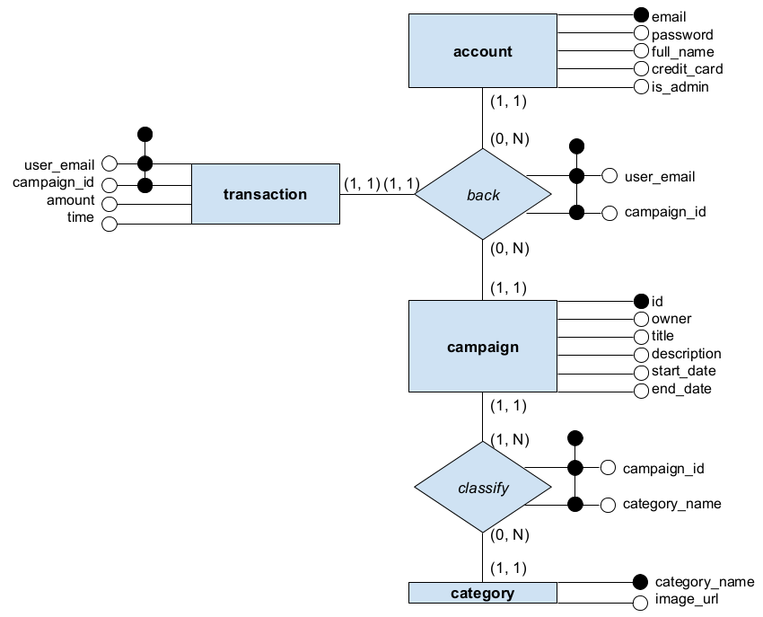

QuickStarter
===

The manager of your company, ThinkCan Pte Ltd, a Singaporean software house, asked your group to design and implement the prototype of an online (Web based) system. The prototype should be realistic in order to convince a major customer to commission your company to develop the system, but should also illustrate the use of relational database technology in order to serve as an in-house showcase application for engineers in your company. It is left to your creativity to design a realistic model for the description of the elements and ancillary information in the system. The design can be kept simple but should be sufficiently rich to allow the meaningful demonstration of SQL and DBMS features. Similarly, you should also populate the database with sufficiently enough data to both make the demonstration realistic and to illustrate the use of interesting SQL and DBMS features.

Description
---

The system is a catalogue of projects looking for crowdfunding. Entrepreneurs can advertise their projects (title, description, start date, duration, keywords or categories, amount of funding sought). Users can browse the projects and fund projects. The system tracks the current amount of funding raised. Administrators can create, modify and delete all entries. Please refer to [kickstarter](http://www.kickstarter.com), [indiegogo](https://www.indiegogo.com/), [fundanything](https://fundanything.com/en), [globalgiving](http://www.globalgiving.org/) or other crowdfunding sites for examples and data.

In order to meet the minimum requirements, the system should allow 1) browsing and searching of entries (basic and advanced search features) and ancillary data, and 2) creation, deletion, and modification of entries and ancillary data. Simple login and sessions may be required by the topic but advanced access control or shopping basket is not required. Extra credit will be gained by appropriate usage and demonstration of advanced SQL and DBMS features (advanced SQL queries such as aggregates, nested queries, views, non standard integrity constraints, triggers, and stored procedures). Choose one of the three candidate topics by indicating your choice using the IVLE project tool.

Database schema can be found [here](http://dbdesigner.net/designer/schema/9043).

Setting Up
---

### Depencies
* [NodeJS](http://nodejs.org)
* [MySQL](https://www.mysql.com/)

### Database setup
1. Start MySQL server
 * For Ubuntu: `sudo start mysql`
2. Access MySQL CLI: `mysql -u root -p` and provide your password for root user
3. Create schema: `CREATE SCHEMA quickstarter;`
4. Select schema to use: `USE quickstarter;`
5. Run table creation script: `source <project_dir>/quickstarter.sql;`
6. Purge database (if your schema has data): `source <project_dir>/quickstarter_reset.sql;`
7. Seed the database: `source <project_dir>/quickstarter_seed.sql;`
8. Exit the CLI: `exit`

### Running localhost
1. Navigate to project directory: `cd <project_dir>`
2. Make a copy of `config.js.sample`, rename it to `config.js` and setup your database configurations there
3. Install NodeJS dependencies for project: `npm install`
4. Start [`localhost:3000`](http://localhost:3000/): `npm start`

Workflow
---

I guess it'll be fine for us to all push to master at the same time, since we will rarely be working on the same piece of code together. If things get complicated we can switch to branching and pull requests. Let's keep it simple for now :)

Schema
---

